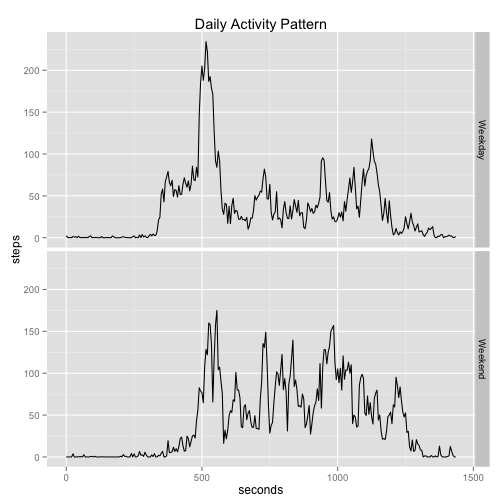

# Reproducible Research: Peer Assessment 1


## Loading and preprocessing the data


```r
library(stringr)
data <- read.csv("./data/activity.csv")
data$date <- as.Date(data$date)
interval <- str_pad(data$interval,4,side="left",pad="0")
minutes <- as.numeric(str_sub(interval,1,2))
data$seconds <- as.numeric(str_sub(interval,3,4))+(minutes*60)
data$wk <- as.factor(ifelse(weekdays(data$date)%in%c("Saturday","Sunday"),
                "Weekend","Weekday"))
```

## What is mean total number of steps taken per day?


```r
library(ggplot2)
dailyTotal <- aggregate(data['steps'],by=list(date=data$date),sum)
g <- qplot(steps, data=dailyTotal, geom="histogram", binwidth=750)
g + labs(title="Histogram of Daily Step Total")
```

 

```r
mean(dailyTotal$steps, na.rm=TRUE)
```

```
## [1] 10766
```

```r
median(dailyTotal$steps, na.rm=TRUE)
```

```
## [1] 10765
```

## What is the average daily activity pattern?


```r
intervalMean <- aggregate(data['steps'],by=list(seconds=data$seconds),mean,
                        na.rm=TRUE)
ggplot(data=intervalMean,aes(x=seconds,y=steps))+
        geom_line()+
        ggtitle("Daily Activity Pattern")
```

 

## Imputing missing values


```r
suppressMessages(library(Hmisc))
impData <- data
impData$steps <- with(impData,impute(steps,mean))
dailyTotal2 <- aggregate(impData['steps'],by=list(date=impData$date),sum)
g <- qplot(steps, data=dailyTotal2, geom="histogram", binwidth=750)
g + labs(title="Histogram of Daily Step Total (Imputed)")
```

 

```r
mean(dailyTotal2$steps)
```

```
## [1] 10766
```

```r
median(dailyTotal2$steps)
```

```
## [1] 10766
```

## Are there differences in activity patterns between weekdays and weekends?


```r
intervalMean2 <- aggregate(data['steps'],by=list(seconds=data$seconds,
                        wk=data$wk),mean,na.rm=TRUE)
ggplot(data=intervalMean2,aes(x=seconds,y=steps))+
        geom_line()+
        facet_grid(wk~.)+
        ggtitle("Daily Activity Pattern")
```

 
